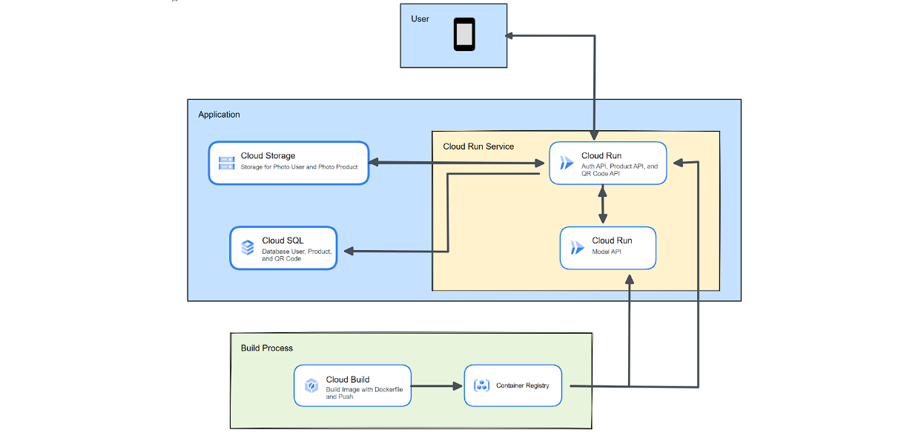

# BiteSense-Api

The Bitesense-Api interacts with the client-side [Mobile-Dev](https://github.com/BiteSense/mobile-dev) and [Machine-Learning](https://github.com/BiteSense/object-detection-model-development), to serving various request from client-side then bridges the requests from client-side to Machine-Learning model

## Cloud-Architecture:



|       Collection       |                                                                                                                                                                   Postman Link                                                                                                                                                                    |
| :--------------------: | :-----------------------------------------------------------------------------------------------------------------------------------------------------------------------------------------------------------------------------------------------------------------------------------------------------------------------------------------------: |
| Backend API collection | [](https://god.gw.postman.com/run-collection/23098382-29753a34-0729-4aea-9324-2080d7026097?action=collection%2Ffork&source=rip_markdown&collection-url=entityId%3D23098382-29753a34-0729-4aea-9324-2080d7026097%26entityType%3Dcollection%26workspaceId%3D8d48ecb2-5360-4889-a18a-58ed2c0cd770) |

## Getting Started:

Tutorials, get you started with understanding and using the Bitesense-Api:

- [Auth](###Auth)
- [Auth-Register](###Register)
- [Auth-Logout](###Logout)

## Documentation:

### Auth

All request require API key. You can find your Api key if you Login.

```http
POST api/users/login
```

| Parameter  | Type     | Description   |
| :--------- | :------- | :------------ |
| `email`    | `string` | **Required**. |
| `password` | `string` | **Required**. |

### Response

Signin user if already have an account. Return a token to use authenticate and authorization.

`SUCCESS`

```javascript
{
    "statusCode": 200,
    "status": "success",
    "message": "success login",
    "data": {
        "token": "eyJhbGciOiJIUzI1NiIsInR5cCI6TIsImV4cCI6MTY4NTMzODY5Mn0.sim8HNM8AELtNpwi6NvKZiv_EDO9YAau513u2cyIW_8"
    }
}
```

`FAILED`

```javascript
{
    "statusCode": 400,
    "status": "error",
    "message": "Email not Register"
}
```

### Register

```http
POST api/users/register
```

| Parameter    | Type     | Description   |
| :----------- | :------- | :------------ |
| `email`      | `string` | **Required**. |
| `password`   | `string` | **Required**. |
| `repassword` | `string` | **Required**. |
| `username`   | `string` | **Required**. |

### Response

Create user if any user already have an account.

`SUCCESS`

```javascript
{
    "statusCode": 200,
    "status": "success",
    "message": "success register"
}
```

`FAILED`

```javascript
{
    "statusCode": 400,
    "status": "error",
    "message": "Email Already Excist"
}
```

### Logout

```http
DELETE api/users/register
```

### Response

`SUCCESS`

```javascript
{
    "statusCode": 200,
    "status": "success",
    "message": "Logout berhasil"
}
```
