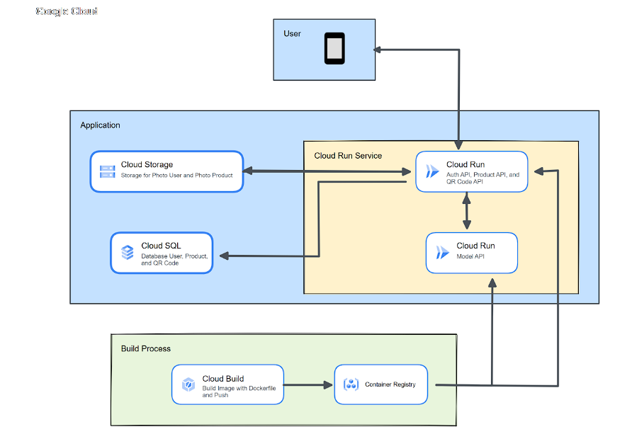

# BiteSense-Api

The Bitesense-Api interacts with the client-side-[Mobile-Dev](https://github.com/BiteSense/mobile-dev) and [Machine-Learning](https://github.com/BiteSense/object-detection-model-development),to serving various request from client-side then bridges the requests from client to Machine-Learning

### Cloud-Architecture:

|       Collection       |                                                                                                                                                                   Postman Link                                                                                                                                                                    |
| :--------------------: | :-----------------------------------------------------------------------------------------------------------------------------------------------------------------------------------------------------------------------------------------------------------------------------------------------------------------------------------------------: |
| Backend API collection |  |
